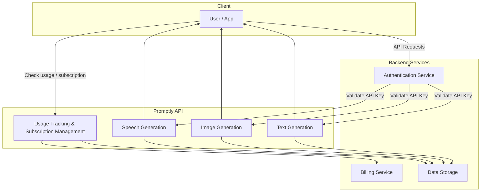
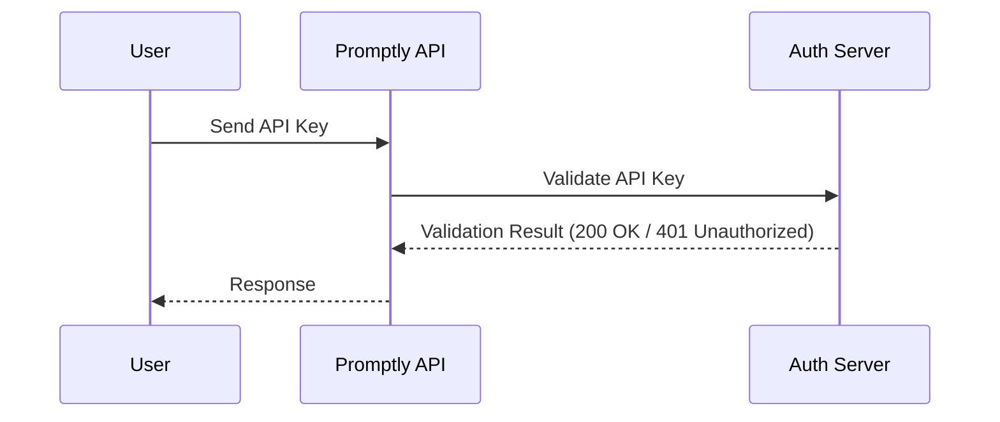

# Promptly API Documentation

Welcome to the **Promptly API** documentation.  
Promptly is a generative AI SaaS platform that helps developers integrate advanced **text, image, and speech generation** into their applications with minimal setup.

## What You Can Do with Promptly
- Generate human-like **text** for chatbots, content, and summarization.
- Create **images** dynamically from text prompts.
- Convert **text to speech** for natural-sounding voices.
- Manage subscriptions, track usage, and monitor API performance.

## Quick Links
- [Quickstart Guide](quickstart.md)
- [API Reference](reference/text-generation.md)
- [Usage Tracking](usage-tracking.md)
- [Subscription Management](reference/subscriptions.md)

## API Architecture

For a high-level overview of how Promptly processes requests, see the architecture diagram:




## Authentication

All requests require an API key.  
You can create and manage keys from your [Promptly Dashboard](https://dashboard.promptly.ai).

Authentication is handled via **Bearer tokens** in the `Authorization` header:

Authorization: Bearer YOUR_API_KEY

Example using `curl`:

```bash
curl -X POST "https://api.promptly.ai/v1/text/generate" \
  -H "Authorization: Bearer YOUR_API_KEY" \
  -H "Content-Type: application/json" \
  -d '{
    "prompt": "Write a motivational quote about innovation."
  }'
```
### Authentication Flow

For a visual of how API key validation works:



## Next Steps

1. Start with the [Quickstart Guide](quickstart.md) to make your first API call.  
2. Explore the [API Reference](reference/text-generation.md) for detailed endpoints and parameters.  
3. Learn how to [track your usage](usage-tracking.md) and manage limits.
