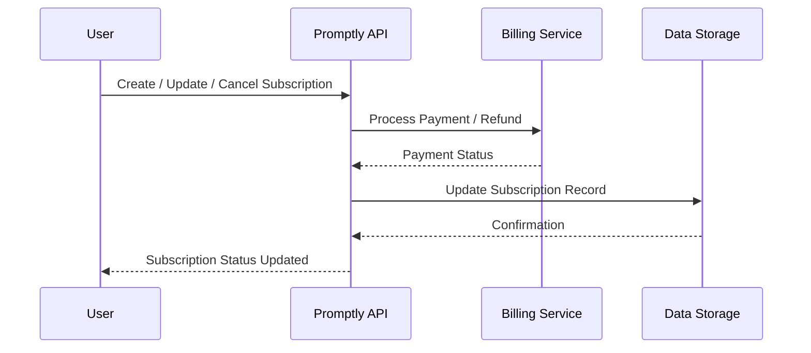

# Usage Tracking

Monitor your API usage, limits, and quotas to ensure you stay within your subscription plan.

## Fetch Usage Data

### Endpoint
GET `/v1/usage`

### Authentication
Bearer token in `Authorization` header:

```http
Authorization: Bearer YOUR_API_KEY
Content-Type: application/json
```

### Example Request

```bash
curl -X GET "https://api.promptly.ai/v1/usage" \
  -H "Authorization: Bearer YOUR_API_KEY"
```

### Example Response

```json
{
  "period": "2025-09-01 to 2025-09-20",
  "text_generation": {
    "used": 1200,
    "limit": 5000
  },
  "image_generation": {
    "used": 30,
    "limit": 100
  },
  "speech_generation": {
    "used": 50,
    "limit": 200
  }
}
```

## Rate Limits and Quotas

| Endpoint            | Limit per Minute | Daily Quota |
|--------------------|----------------|------------|
| Text Generation     | 60             | 5000       |
| Image Generation    | 10             | 100        |
| Speech Generation   | 20             | 200        |

> For visual reference of how usage tracking works, see the [API Architecture Diagram](diagrams/api-architecture.mmd).

---

# Subscription Overview

Understand your account subscription, billing, and plan limits.

## Subscription Tiers

| Plan      | Monthly Cost | Text Gen | Image Gen | Speech Gen |
|-----------|-------------|----------|-----------|------------|
| Free      | $0          | 500      | 5         | 20         |
| Pro       | $29         | 5000     | 100       | 200        |
| Enterprise| Custom      | Unlimited| Unlimited | Unlimited  |

## Managing Subscriptions

### Create a Subscription
```bash
curl -X POST "https://api.promptly.ai/v1/subscriptions" \
  -H "Authorization: Bearer YOUR_API_KEY" \
  -H "Content-Type: application/json" \
  -d '{
    "plan": "Pro"
  }'
```

### List Subscriptions
```bash
curl -X GET "https://api.promptly.ai/v1/subscriptions" \
  -H "Authorization: Bearer YOUR_API_KEY"
```

### Cancel Subscription
```bash
curl -X DELETE "https://api.promptly.ai/v1/subscriptions/sub-001" \
  -H "Authorization: Bearer YOUR_API_KEY"
```

### Usage Flow Diagram

The following sequence diagram illustrates how usage tracking and subscription updates propagate through the system:



---

## Notes

- Usage data is **updated in near real-time**.  
- Exceeding quotas will return `429 Too Many Requests`.  
- Subscription changes take effect **immediately** for new billing cycles.  
- Always include your **API key** in requests to track usage correctly.
